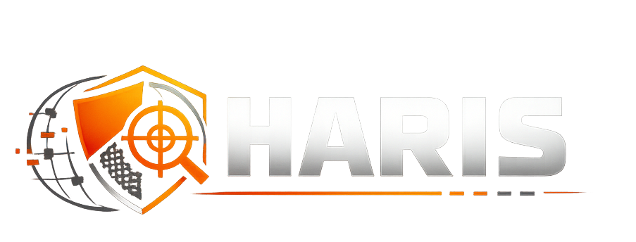

<p align="center">
  <br>
  <em>Black-box web security audit framework — scan, correlate, prioritise, remediate.</em><br><br>
  <a href="https://opensource.org/licenses/MIT"></a>
  <a href="https://www.python.org/downloads/"></a>
  <a href="https://owasp.org/www-project-top-ten/"></a>
</p>

Orchestrates multiple security scanners, correlates findings, and produces a single prioritised report with business-risk context. Optionally uses LLMs for post-scan analysis and remediation planning.

## What This Does Differently

1. **Cross-tool correlation** — findings from all scanners are fingerprinted and merged; duplicates become one confirmed finding.
2. **Cross-scanner intelligence** — technologies, URLs, ports, and headers detected by earlier scanners feed into later ones (e.g. Nuclei targets WordPress-specific templates after Nmap detects WordPress).
3. **Business-risk translation** — plain-language impact statements alongside technical details.
4. **Prioritised remediation** — fixes grouped and sorted by impact-to-effort ratio.
5. **Scenario-based profiles** — `pre-launch`, `regression`, `compliance`, etc.
6. **Reusable scan templates** — named presets with per-scanner overrides, saved and reused from the web UI.
7. **LLM-powered analysis** — Q&A, Jira tickets, test cases, and enrichment grounded in actual scan data.
8. **OWASP Top 10 (2025) mapping** — all findings auto-mapped, including Supply Chain Failures and Exceptional Conditions.

## Scanners

| Scanner | What It Tests | Install |
| ------- | ------------- | ------- |
| Wapiti | SQLi, XSS, SSRF, command injection, CRLF, XXE | `pipx install wapiti3` |
| SSLyze | TLS protocols, cipher suites, certificate chain, Heartbleed/ROBOT | `pipx install sslyze` |
| Nmap | Open ports, service versions, exposed databases | system package manager |
| Nikto | Web server misconfigurations, outdated software, dangerous files | `brew install nikto` |
| Nuclei | CVE detection, default credentials, exposed panels, tech fingerprinting (multi-phase) | `brew install nuclei` |

## Built-in Checks

| Check | What It Tests |
| ----- | ------------- |
| header_checks | 7 security headers (HSTS, CSP, X-Frame-Options, etc.), cookie flags, server banner |
| tls_checks | Certificate expiry, protocol version, cipher strength |
| misc_checks | CORS policy, HTTP→HTTPS redirect, 14 sensitive paths (.env, .git/config, admin panels) |
| info_disclosure | Error page leaks, debug endpoints, HTML comments, version endpoints |
| cookie_checks | Secure/HttpOnly/SameSite flags, domain scope, expiry |

## Setup

```bash
git clone <repo-url> && cd HARIS
uv venv .venv && source .venv/bin/activate
uv pip install -e ".[all]"
```

External tools (Nmap, Nikto, Nuclei, SSLyze, Wapiti) need separate installation — invoked as CLI commands. For LLM features, set `ANTHROPIC_API_KEY` or `OPENAI_API_KEY`.

## Usage

```bash
# CLI
python scripts/run_scan.py --url https://example.com --profile quick --yes
python scripts/run_scan.py --list-profiles

# Web dashboard
python scripts/run_scan.py --web   # http://localhost:8000

# Docker
docker compose up
docker compose run --rm cli --url https://example.com --profile quick --yes

# LLM analysis (after a scan completes)
python scripts/run_scan.py llm ask --scan-id <id> --question "Top 3 risks for an exec"
python scripts/run_scan.py llm remediate --scan-id <id> --format jira
python scripts/run_scan.py llm summarize --scan-id <id> --audience developer

# In-pipeline LLM enrichment
python scripts/run_scan.py --url https://example.com --profile quick --yes --llm-enrich

# Scanner template updates
python scripts/run_scan.py update-templates
python scripts/run_scan.py update-templates --scanner nuclei --list
```

## Scan Profiles

| Profile | Scanners | Use Case |
| ------- | -------- | -------- |
| `quick` | Built-in checks only | First look, ~1-3 min |
| `pre-launch` | Built-in + Nmap, SSLyze, Wapiti | Before production deploy, ~10-30 min |
| `full` | Everything including Nikto, Nuclei | Full audit, ~20-30 min |
| `regression` | header_checks, tls_checks, misc_checks | CI gate, ~30-60s |
| `compliance` | Built-in + Nmap, SSLyze | SOC 2 / PCI-DSS prep, ~5-15 min |

## Configuration

Copy `.env.example` to `.env`. See `config/default_config.yaml` for all options.

| Variable | Purpose |
| -------- | ------- |
| `ANTHROPIC_API_KEY` | Anthropic LLM backend |
| `OPENAI_API_KEY` | OpenAI LLM backend |
| `OLLAMA_BASE_URL` | Ollama server (default: `http://localhost:11434`) |
| `HARIS_TARGET_URL` | Default scan target |
| `HARIS_PROFILE` | Default scan profile |
| `HARIS_AUTH_HEADER` | Auth header for target |

## Extending

See [`docs/`](docs/) for full developer guides.

- **Scanner**: subclass `BaseScanner`, `@register_scanner` — [`docs/integrating_tools.md`](docs/integrating_tools.md)
- **Custom check**: same interface, `@register_check` — [`docs/writing_checks.md`](docs/writing_checks.md)
- **Report format**: subclass `BaseReporter`, implement `generate()`
- **LLM backend**: subclass `BaseLLMBackend`, implement `complete()`
- **Architecture & templates**: [`docs/architecture.md`](docs/architecture.md)
- **LLM integration**: [`docs/llm_integration.md`](docs/llm_integration.md)

## Limitations

- Black-box only — no source code analysis.
- Basic auth (cookie/header); complex flows (OAuth, MFA) need manual session setup.
- LLM features require an API key and incur costs — entirely optional.
- Validate findings with a security professional before acting on them.
- External scanner results depend on those tools being installed and up to date.

## Legal

For authorised testing only. See [LEGAL_NOTICE.md](LEGAL_NOTICE.md).

## License

MIT. See [LICENSE](LICENSE).
